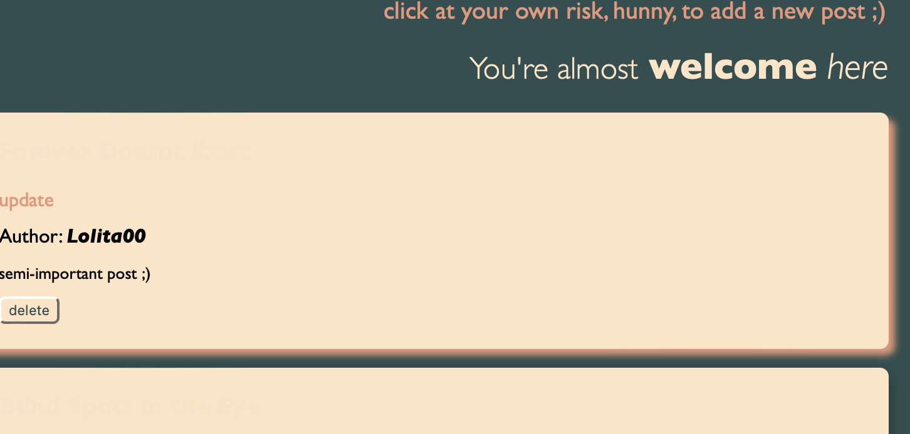

# Mistress Blog
* used to be master blog (Codio project), but became mistress due to some personal reasons ;)

**Mistress Blog** — a minimalist blog platform, where users can create, update, and delete blog posts. This project is built using Python and Flask and features dynamic content management via a JSON file.

## Features

- **Create New Posts**: Add new blog posts with a title, author, and content.
- **Update Existing Posts**: Modify the content of your existing blog posts.
- **Delete Posts**: Remove posts with a confirmation step to avoid accidental deletions.
- **Dynamic Styling**: A sleek, dark-themed design with subtle color transitions and interactive elements.

## Technologies Used

- **Flask**: Lightweight web framework for Python.
- **HTML/CSS**: For the structure and styling of the blog.
- **JavaScript**: For interactivity, including confirmation dialogs and dynamic styling.
- **JSON**: Simple storage of blog posts.

## Conclusion

- Through this project, I learned how to implement dynamic content with Flask, handle CRUD operations with JSON files, and manage simple front-end design.
- In the future, I plan to implement user authentication and enhance the styling of the blog platform, possibly integrating a database for more scalable storage.
